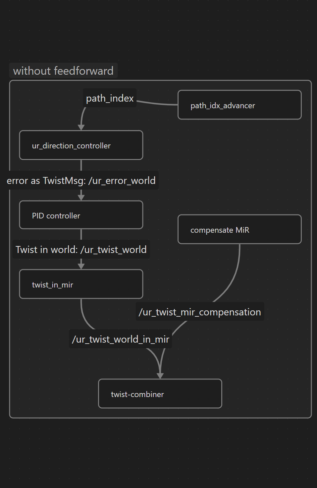
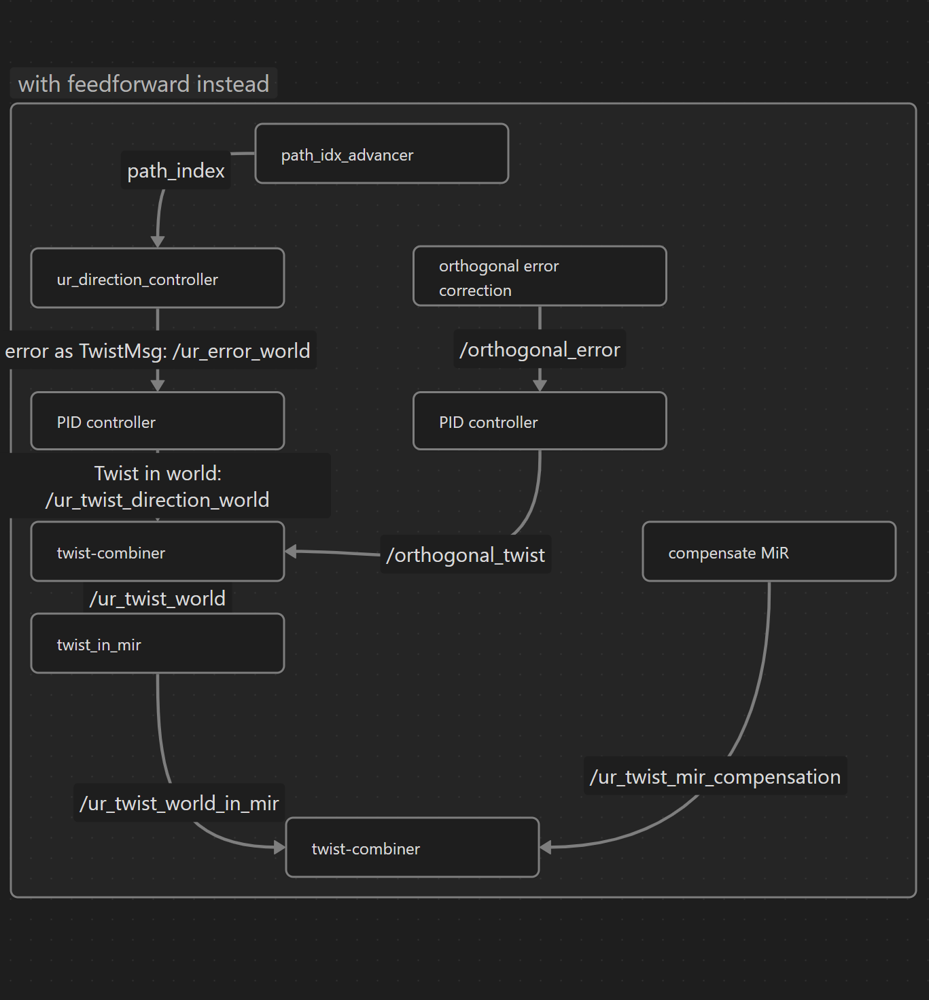

# Match Additive Manufacturing

This repository contains packages related to additive manufacturing processes. Below is a brief description of each package included in this repository.

## Packages

### 1. ur_trajectory_follower



For details on the `ur_trajectory_follower` package, please refer to the [README](ur_trajectory_follower/README.md) file in the `ur_trajectory_follower` directory.

## Prerequisites

This package requires the following to be installed:

- [ROS](http://wiki.ros.org/ROS/Installation)
- match_mobile_robotics
- [match_lib](https://github.com/pumablattlaus/match_lib_package)

## Installation

To install the packages, clone the repository and run the setup script to install dependencies and build the workspace:

```bash
git clone https://github.com/match-ROS/match_additive_manufacturing.git
cd match_additive_manufacturing
./setup.sh
```

## Usage

To use the packages, source the workspace and run the desired nodes:

```bash
source devel/setup.bash
```

To launch everything:

```bash
roslaunch print_sim run_simulation_complete.launch
roslaunch ur_trajectory_follower complete_ur_trajectory_follower_ff_only.launch
```

## Contributing

Contributions are welcome! Please fork the repository and submit a pull request.

## License

See the [LICENSE](LICENSE.md) file for license rights and limitations (MIT).

## DOI

https://doi.org/10.5281/zenodo.14507474

## Contact
 
For any questions or inquiries, please contact matchbox@match.uni-hannover.de
