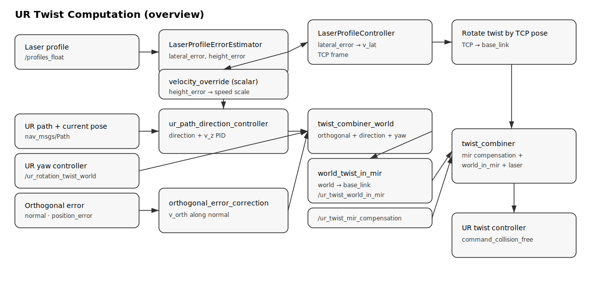

# Match Additive Manufacturing

This repository contains packages related to additive manufacturing processes. Below is a brief description of each package included in this repository.

## Packages

### 1. ur_trajectory_follower


#### UR Twist Computation (overview)


**Errors computed**
- **Laser lateral error**: index offset of the profile peak (from `laser_profile_error_estimator.py`).
- **Laser height error**: target minus measured height (used to adjust speed override).
- **Path tracking error**: direction to the next waypoint + Z error (PID on height).
- **Orthogonal error**: projection of pose error onto the path normal.

**Twist components**
- **Laser lateral correction**: `laser_profile_controller.py` maps lateral error to a lateral velocity in TCP frame, then rotates it into base frame.
- **Path following**: `ur_path_direction_controller.py` outputs forward motion along the path plus Z PID.
- **Orthogonal correction**: `orthogonal_error_correction.py` outputs a correction twist along the path normal.
- **Frame conversion**: `world_twist_in_mir.py`/`rotate_twist_by_pose.py` rotate world-frame twists into base frame.

**Combination**
- `combine_twists.py`/`twist_combiner` sums the active twist components into the final UR command (`command_collision_free`).

**Velocity override (not a twist)**
- `velocity_override` is a scalar that scales the path-following speed inside `ur_path_direction_controller.py` (not combined by `twist_combiner_world`).

For details on the `ur_trajectory_follower` package, please refer to the [README](ur_trajectory_follower/README.md) file in the `ur_trajectory_follower` directory.

## Prerequisites

This package requires the following to be installed:

- [ROS](http://wiki.ros.org/ROS/Installation)
- match_mobile_robotics
- [match_lib](https://github.com/pumablattlaus/match_lib_package)

## Installation

To install the packages, clone the repository and run the setup script to install dependencies and build the workspace:

```bash
git clone https://github.com/match-ROS/match_additive_manufacturing.git
cd match_additive_manufacturing
./setup.sh
```

## Usage

To use the packages, source the workspace and run the desired nodes:

```bash
source devel/setup.bash
```

To launch everything:

```bash
roslaunch print_sim run_simulation_complete.launch
roslaunch ur_trajectory_follower complete_ur_trajectory_follower_ff_only.launch
```

## Measurement Data

Measurement results in Rosbag format can be found at the following link


```
https://seafile.cloud.uni-hannover.de/d/9b66d3d6af834b0b815f/
```
## Contributing

Contributions are welcome! Please fork the repository and submit a pull request.

## License

See the [LICENSE](LICENSE.md) file for license rights and limitations (MIT).

## DOI

https://doi.org/10.5281/zenodo.14507474

## Contact
 
For any questions or inquiries, please contact matchbox@match.uni-hannover.de
